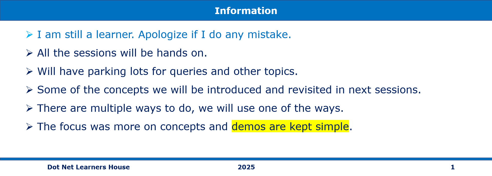

# 📢 Dot Net Learners House Meetup – Monthly Event - Mar 2025

## Date Time: 13-APR-2025 at 04:00 AM IST

## Event URL: [https://www.meetup.com/dot-net-learners-house-hyderabad/events/306640169](https://www.meetup.com/dot-net-learners-house-hyderabad/events/306640169)





## *🎯 Goal of the Session:*  
By the end of this session, attendees will: 
🎯Module 3: Control Flow Statements
In this module, we will cover the following concepts:
✅ Conditional Statements: Learn how to use if, elif, and else statements to control the flow of a program based on conditions.
✅  Loops: Understand how to use for loops and while loops to perform repetitive tasks efficiently.
✅   Loop Control Statements: Explore how to use break, continue, and pass to manage loop behavior and enhance program flexibility.

---

## *📝 Demo Script:*

### *1️⃣ Introduction (2 min)*
"Hey everyone! Great to have you here."
"Today, we’re diving into a key part of Python—Control Flow Statements."
"We’ll look at how to make decisions in code using if, elif, and else."
"Then we’ll explore loops—for and while—to handle repetition."
"And finally, we’ll learn how break, continue, and pass help control loop behavior."
"By the end, you’ll be able to write more dynamic and flexible Python programs."

---
# Condition statement:


Conditional statements allow a program to make decisions and take different actions depending on certain conditions. In Python, the main conditional statements are if, elif, and else.

The if statement checks whether a condition is true. If it is, the program runs the code inside that block.

The elif (short for "else if") is used to check another condition if the first one is false. You can use multiple elif statements to check different conditions one by one.

The else statement is used at the end to catch all other cases when none of the previous conditions are true.

These statements help control the flow of the program and allow it to behave differently depending on input or data.

IF STATEMENT:


The if statement is used in programming to check if a condition is true. If it is, the program runs a certain block of code. If not, it skips that part. This helps the program make decisions. For example, if a number is greater than 0, it can print "Positive number." The if statement is a simple but powerful tool to control what the program does.

### **`if` Statement Syntax:**
```python
if condition:
    # code to run if the condition is true
```
IF ELSE STATEMENT:


The if-else statement is used in programming to choose between two options. If a condition is true, the code inside the if block runs. If the condition is false, the code inside the else block runs instead. This helps the program decide what to do in different situations.

### **`if-else` Statement Syntax:**
```python
if condition:
    # code to run if the condition is true
else:
    # code to run if the condition is false
```
---
IF ELIF STATEMENT:


The if-elif statement is used to check multiple conditions. It starts with an if. If that condition is false, it checks the next one using elif. As soon as one condition is true, that block of code runs, and the rest are skipped. This helps the program choose between many options.

### **Syntax:**
```python
if condition1:
    # do this
elif condition2:
    # do that
else:
    # do something else
```
FOR LOOPS:


A for loop is used in programming to repeat a block of code a certain number of times. It is often used to go through items in a list, string, or range of numbers.

for variable in sequence:
    # code block to repeat

for – starts the loop

variable – a name that takes the value of each item in the sequence (like a list or range)

in – keyword that connects the variable to the sequence

sequence – the group of items to loop through (like range(5), a list, or a string)

The indented code block runs for each item in the sequence

WHILE LOOPS:


🔁 While Loop Syntax:

while condition:
    # code block to repeat
while – starts the loop

condition – the loop keeps running as long as this is true

The indented code block runs again and again until the condition becomes false


Loop Control Statements help manage how loops behave in a program.

break stops the loop immediately.

continue skips the current loop step and moves to the next.

pass does nothing—it’s just a placeholder.

These tools make your loops more flexible and allow better control over how your program runs.

🔚 break Statement Syntax:
for variable in sequence:
    if condition:
        break
    # other code

# or with while loop

while condition:
    if condition_to_stop:
        break
    # other code

🔁 continue Statement Syntax:
for variable in sequence:
    if condition:
        continue
    # other code

# or with while loop

while condition:
    if condition_to_skip:
        continue
    # other code

⏸️ pass Statement Syntax:
for variable in sequence:
    if condition:
        pass  # does nothing
    # other code

# or in a function or class

def my_function():
    pass  # placeholder for future code

"That’s all from my side for today. I hope you now have a clear idea about control flow statements, including if, elif, else, loops like for and while, and the loop control statements break, continue, and pass. These are very important building blocks in programming and help us control how our code runs.

Thank you all for listening patiently!
